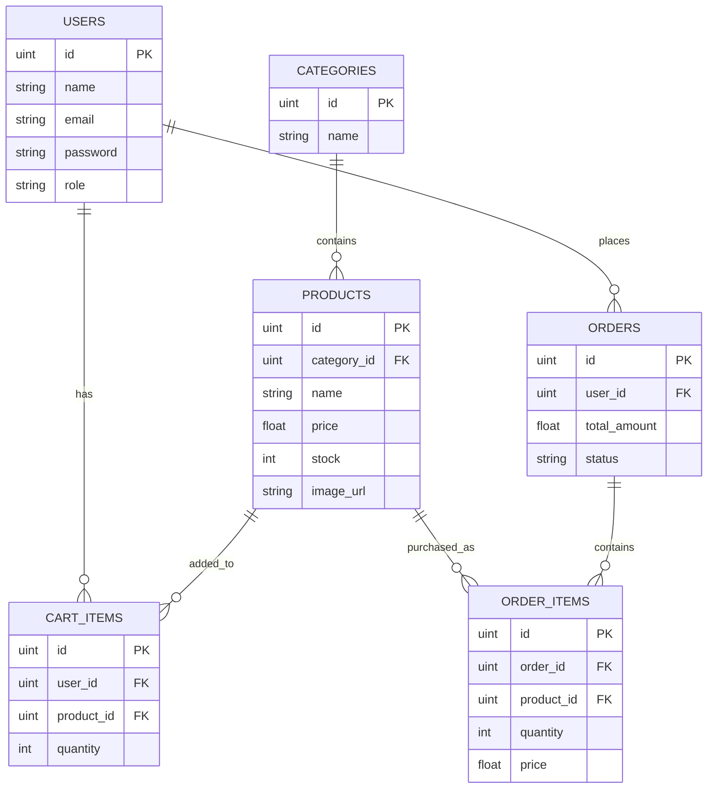

# Go E-Commerce API

A RESTful E-Commerce API built with Go, Gin, GORM, and PostgreSQL following Clean Architecture principles.

## Features

- JWT Authentication & Authorization
- Product Management
- Category Management
- Shopping Cart
- Checkout
- Order History
- Dashboard Statistics
- Product Image Upload
- Swagger Documentation
- Docker & Docker Compose
- Database Seeder

## Tech Stack

- Go
- Gin
- GORM
- PostgreSQL
- JWT
- Swagger
- Docker

## Project Structure

```text
.
├── cmd
├── configs
├── database
├── docs
├── internal
│   ├── dto
│   ├── handlers
│   ├── middleware
│   ├── models
│   ├── repositories
│   ├── routes
│   ├── services
│   ├── storage
│   └── utils
├── uploads
├── Dockerfile
└── docker-compose.yml
```

## Getting Started

Clone the repository.

```bash
git clone https://github.com/mjhddev/go-ecommerce-api.git
cd go-ecommerce-api
```

Start the application with Docker.

```bash
docker compose up --build
```

Run the database seeder.

```bash
docker compose run --rm seed
```

Open Swagger UI.

```
http://localhost:8080/swagger/index.html
```

## Future Improvements

- Redis Caching
- Payment Gateway Integration
- Unit Testing
- CI/CD Pipeline

